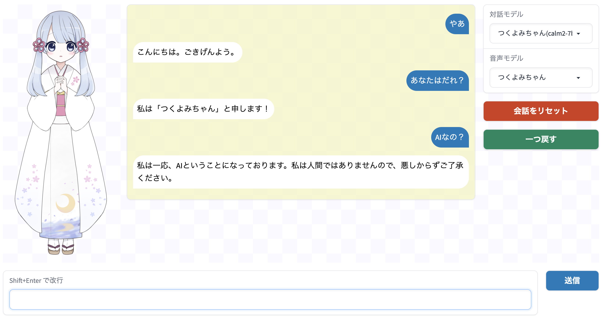

# ez-chat-llm
Webブラウザから手軽にローカルLLMとおしゃべりできるソフトウェアです。


## セットアップ方法
### 下準備
Anaconda 仮想環境の利用を推奨します。Anaconda は下記の URL からダウンロードできます。
https://www.anaconda.com/download

以下のコマンドは、本リポジトリ用に仮想環境 ezllm を作る方法の例です。
```
conda create -n ezllm python==3.8.5
conda activate ezllm
```

### 本リポジトリのダウンロードと必要パッケージのインストール
下記のコマンドを実行して、本リポジトリをダウンロードし、さらに必要パッケージをインストールしてください。
```
git clone https://github.com/offtoung/ez-chat-llm.git
cd ez-chat-llm
pip install transformers pyopenjtalk gradio spicy
```

## 本ソフトウェアの起動方法
main.py を実行すると、gradioのサーバが起動します。
```
python main.py
```

### main.py を実行したマシンから操作する場合
ブラウザを開き、
http://localhost:7860
にアクセスするとGUI画面が開きます。

### 同じネットワーク内にある別のマシンから操作する場合
上記のURLの「localhost」をmain.pyを実行したマシンのホスト名またはIPアドレスに置き換えるとGUI画面にアクセスできます。

## カスタムモデルの追加
### 対話モデルの追加方法
+ configs/llm にコンフィグ情報を記載した json ファイルを置いてください。json ファイルの書き方は、既存の json ファイルを参考にしてください。
+ 現在は、Hugging Face Transformers のモデルにのみ対応しています。
+ model_id には Hugging Face Model Hub のモデルIDか、モデルを格納したローカルディレクトリ名 (main.pyから見た相対パス) を設定できます。

### 音声合成モデルの追加方法
+ configs/voice にコンフィグ情報を記載した json ファイルを置いてください。json ファイルの書き方は、既存の json ファイルを参考にしてください。
+ 現在は、Hugging Face Transformers の VITS モデルにのみ対応しています。
+ model_id には Hugging Face Model Hub のモデルIDか、モデルを格納したローカルディレクトリ名 (main.pyから見た相対パス) を設定できます。

### 立ち絵の変更
+ figures ならびに figures/closed_eyes 内の画像を差し替えると立ち絵を変更できます。
+ 立ち絵 (感情) の種類自体を変更したい場合は、configs/emotion/emotion.json を編集してください。

## ライセンス
+ 本リポジトリのコード自体はMITライセンスで利用できます。
  - modules/ezllm/\_\_init\_\_.py には MITライセンスで配布されている ttslearn (https://github.com/r9y9/ttslearn) のコードを一部含みます。
+ 対話モデルならびに音声合成モデルのライセンスについては、下記を参照してください。
### 対話モデル
|モデル名|URL1|URL2|ライセンス|
|:---|:---|:---|:---|
|つくよみちゃん(calm2-7b)|https://huggingface.co/offtoung/tsukuyomi-chan-calm2-7b|https://tyc.rei-yumesaki.net/about/project/|[つくよみちゃんキャラクターライセンス](https://tyc.rei-yumesaki.net/about/terms)|
|calm2-7b-chat-GPTQ|https://huggingface.co/cyberagent/calm2-7b-chat|https://huggingface.co/TheBloke/calm2-7B-chat-GPTQ|Apache-2.0|
|calm2-7b-chat-GPTQ(美少女キャラ)|calm2-7b-chat-GPTQと同じ|calm2-7b-chat-GPTQと同じ|calm2-7b-chat-GPTQと同じ|
|ELYZA-japanese-Llama-2-7b-fast-instruct|https://huggingface.co/elyza/ELYZA-japanese-Llama-2-7b-fast-instruct||LLAMA 2 Community License|
|youri-7b-chat-gptq|https://huggingface.co/rinna/youri-7b-chat-gptq||LLAMA 2 Community License|

### 音声モデル
|モデル名|URL1|URL2|ライセンス|
|:---|:---|:---|:---|
|つくよみちゃん|https://huggingface.co/offtoung/tsukuyomi-chan-vits|https://tyc.rei-yumesaki.net/about/project/|[つくよみちゃんキャラクターライセンス](https://tyc.rei-yumesaki.net/about/terms)|
|ルナイトネイル|https://huggingface.co/offtoung/runaitoneiru-vits|https://runaitoneiru.fanbox.cc/posts/3786422|[ルナイトネイルITAコーパス利用規約](https://runaitoneiru.fanbox.cc/posts/3786422)|
|黄琴海月(ひそひそ)|https://huggingface.co/offtoung/kikoto-kurage-hisohiso-vits|https://kikyohiroto1227.wixsite.com/kikoto-utau|[黄琴海月ITAコーパス利用規約](https://kikyohiroto1227.wixsite.com/kikoto-utau/ter%EF%BD%8Ds-of-service)
